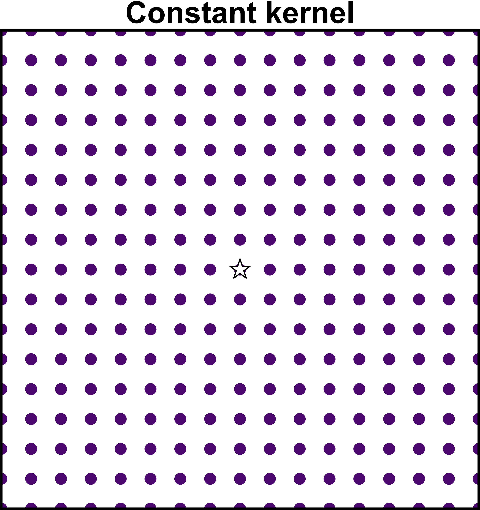
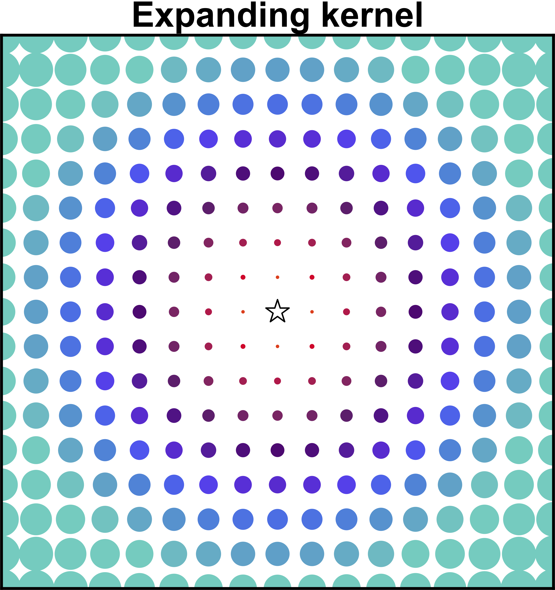
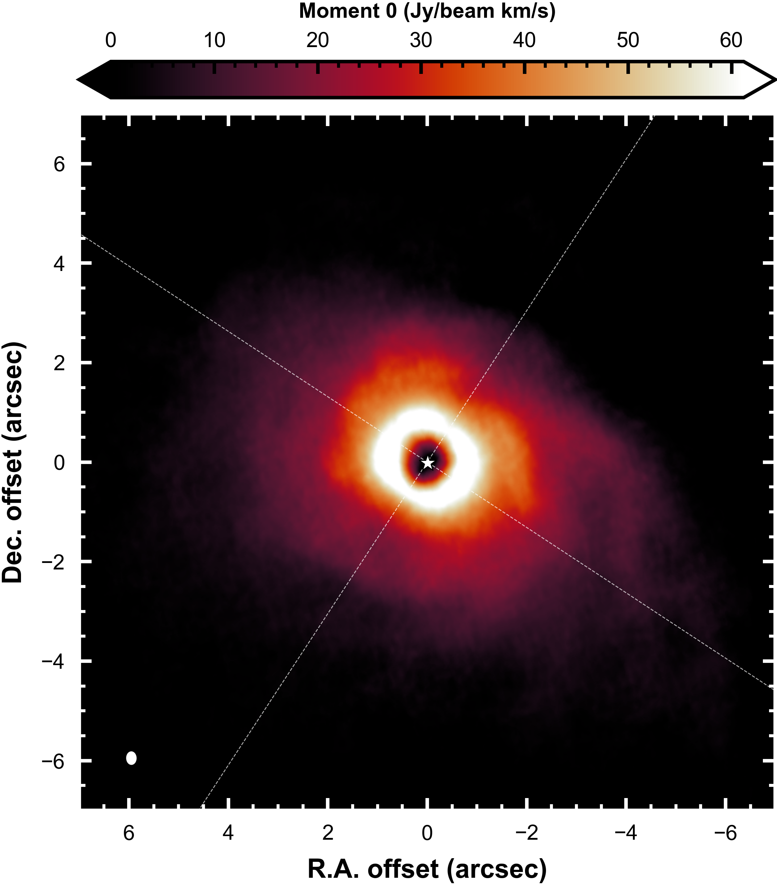
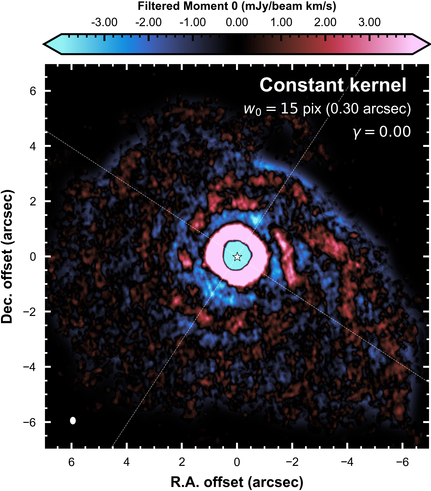
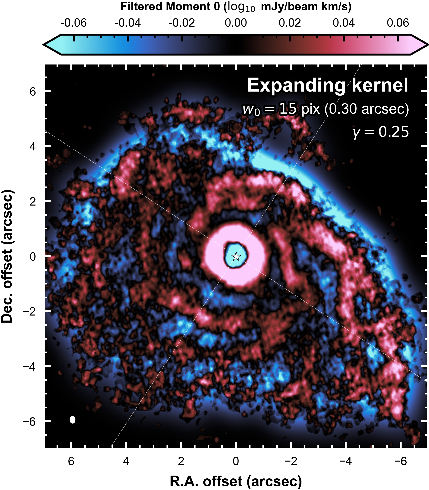
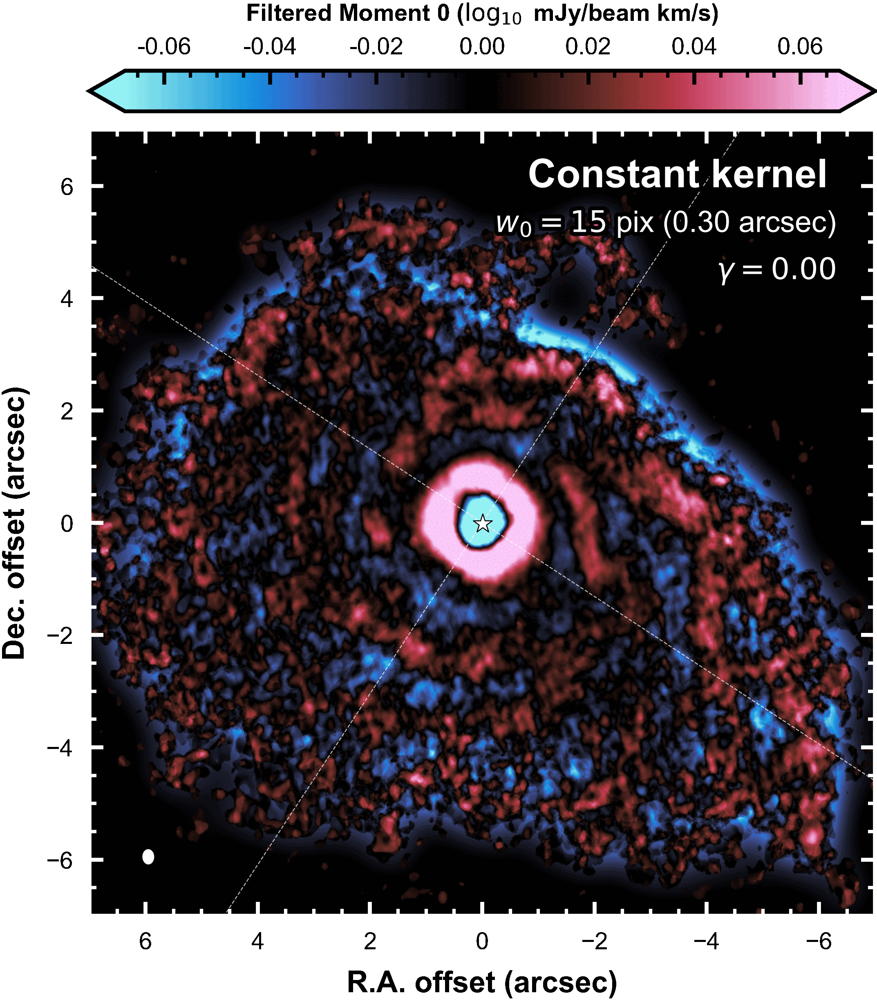

# Background

High-pass filtering (a.k.a. unsharp masking) is a common technique to increase the visual contrast of variations in an image. The conventional approach is to convolve the image with a 2D Gaussian kernel and subtract the blurred image from the original, leaving just the fine-structure "residuals". This has been successfully done to reveal non-axisymmetric structure in continuum and scattered light images of protoplanetary disks (e.g., [Perez et al. 2016](https://ui.adsabs.harvard.edu/abs/2016Sci...353.1519P), [Meru et al. 2017](https://ui.adsabs.harvard.edu/abs/2017ApJ...839L..24M), [Boccaletti et al. 2020](https://ui.adsabs.harvard.edu/abs/2020A&A...637L...5B), [Zhang et al. 2023](https://ui.adsabs.harvard.edu/abs/2023A&A...672A.145Z), [Garufi et al. 2024](https://ui.adsabs.harvard.edu/abs/2024arXiv240302158G); deepest reference for the idea seems to be [Malin 1977](https://ui.adsabs.harvard.edu/abs/1977AASPB..16...10M/abstract)).
The equivalent result can also be achieved in Fourier space, in which case the Fourier transform of the image is convolved with an inverse Gaussian kernel (e.g., [Rosotti et al. 2020](https://ui.adsabs.harvard.edu/abs/2020MNRAS.491.1335R), [Norfolk et al. 2022](https://ui.adsabs.harvard.edu/abs/2022ApJ...936L...4N)).

High-pass filtering with a spatially constant Gaussian kernel is easy with [scipy](https://docs.scipy.org/doc/scipy/reference/generated/scipy.ndimage.gaussian_filter.html) for example:

```python
# High-pass filtering with a spatially constant Gaussian kernel
from scipy.ndimage import gaussian_filter
residuals = image - gaussian_filter(image, sigma=5)
```

where ``sigma`` is the standard deviation of the 2D Gaussian kernel (in both dimensions), in units of image pixels.

Let's consider the properties of such a spatially constant kernel. At one extreme, if the kernel width is small, the "background" (blurred) image is basically still the original. The resulting high-pass filter residuals will only highlight the finest spatial scale and low-level structure (read: noise). At the other extreme, if the kernel width is very big, all structure is smeared away in saturation. In between, a kernel of a given width highlights structure on spatial scales similar to its width.

Here's an example with the ALMA continuum image of the HD 163296 disk from [Andrews et al. (2018)](https://ui.adsabs.harvard.edu/abs/2018ApJ...869L..41A/abstract). For reference, the synthesized beam is 0.05'' x 0.04''. First, a kernel width that is so small (0.006'') it highlights mostly noise:

<p align='center'>
  
</p>

Second, a kernel width that is very large (0.3''). Structure in the inner disk is smeared out or oversaturated, though structure in the outer disk comes through alright:

<p align='center'>
  
</p>

Finally, a happy-medium-sized kernel (0.04'', similar to the beam):

<p align='center'>
  
</p>

The happy-medium case nicely highlights structure in the inner disk, but things get a little bit closer to the noise in the outer disk. This set of examples demonstrates two things:

1. A bigger kernel helps bring faint emission out of the noise.
2. A smaller kernel highlights structure on smaller spatial scales.  

In images where the strength of emission falls rapidly with distance from the star, and where the spatial scale of structures increases with distance from the star, a spatially constant kernel struggles to do all of the following simultaneously:

1. Highlight small-scale structure in the inner disk *and* large-scale structure in the outer disk;
2. Avoid oversaturation in the inner disk *but also* capture faint emission in the inner disk.

The expanding kernel approach goes some way toward a solution to these limitations of a constant kernel.

# An expanding kernel

The idea is to perform the convolution with a radially expanding 2D Gaussian kernel, i.e., one whose width $`w`$ increases with distance from the image center according to a simple power-law:

```math
w(r) = w_0 \cdot (r/r_0)^{\gamma}
```

where $`w_0`$ is the kernel width at $`r_0=1''`$. Schematically, this is the difference:

<p align='center'>
  
  
</p>

How do we code up a convolution with a kernel whose width varies over the image? I could not find a way. Instead, we solve the inverse problem: we first stretch the image with the *inverse scaling* as we want the kernel to have, then perform the convolution on that stretched map with a *spatially constant kernel*, and then undo the stretch to restore the image to its original grid. Credit for the idea goes to [tom10 on stackoverflow](https://stackoverflow.com/questions/18624005/how-do-i-perform-a-convolution-in-python-with-a-variable-width-gaussian). **Nota bene: Interpolation is thus involved - not just once, but twice.**


# Example Usage

The basic call is:

```python
# High-pass filtering with a radially expanding Gaussian kernel.
from expanding_kernel import get_residual
residual = get_residual(data=image, xaxis=xaxis, yaxis=xaxis, gamma=gamma, w0=w0, interp_kind='cubic', return_background=False)
```

The ``get_residual`` function convolves the input image ``data`` with a Gaussian kernel whose standard deviation is parameterized by ``gamma`` and ``w0``, and returns the residual after subtracting this blurred map from the original (if ``return_background`` is ``False``, else it returns the blurred map). The input `xaxis` and `yaxis` specify the image's original grid, and are assumed to be centered on the origin. The interpolation onto and off of the stretched image grid (see above) is done with [scipy.interpolate.interp2d](https://docs.scipy.org/doc/scipy/reference/generated/scipy.interpolate.interp2d.html), and ``interp_kind`` specifies kind of spline.

Here's an example using ALMA observations of <sup>13</sup>CO emission toward AB Aurigae presented in [Speedie et al. (submitted)](https). We'll use the moment 0 map, which you can download [here](https). With a linear colorbar, it looks like this:

<p align='center'>
  
</p>


## Spatially constant kernel

```python
from expanding_kernel import get_residual
import matplotlib.pyplot as plt

# Load the image using the infrastructure of gofish
from gofish import imagecube # https://github.com/richteague/gofish/tree/master
image = imagecube('path/to/moment0map.fits') # Has xaxis and yxaxis attributes defined the same way that expanding_kernel.get_residual assumes

w0    = 15   # Gaussian kernel width (in units of pixels) at r=1''
gamma = 0.0  # Power of r with which Gaussian kernel width scales; gamma=0 is a constant kernel

residual = kit.get_residual(data=m0.data, xaxis=m0.xaxis, yaxis=m0.yaxis, gamma=gamma, w0=w0, interp_kind='cubic', return_background=False)

fig, ax = plt.subplots()
norm_r = mpl.colors.Normalize(vmin=-0.2*np.nanmax(residual), vmax=0.2*np.nanmax(residual))
ax.pcolormesh(m0.xaxis, m0.yaxis, residual, cmap=cmap_r, norm=norm_r)

cb = mpl.colorbar.ColorbarBase(ax=cax, cmap=cmap_r, norm=norm_r)
cb.set_label(r'Filtered Moment 0 (mJy/beam km/s)')
plt.show()
```

<p align='center'>
  
</p>

There's definitely structure to be seen there, but at a disparate dynamical range to the inner ring at ~1''. The ring is very bright and the strength of emission falls very rapidly with distance from the star. We can try compressing the overall dynamical range of the input image by feeding in the log<sub>10</sub> of the image:

```python
w0    = 15   # Gaussian kernel width (in units of pixels) at r=1''
gamma = 0.0  # Still a constant kernel

residual = kit.get_residual(data=np.log10(m0.data+10), \ # Pad with 10 to avoid possible log10(0) in background sky pixels
            xaxis=m0.xaxis, yaxis=m0.yaxis, gamma=gamma, w0=w0, interp_kind='cubic', return_background=False)

fig, ax = plt.subplots()
norm_r = mpl.colors.Normalize(vmin=-0.3*np.nanmax(residual), vmax=0.3*np.nanmax(residual))
ax.pcolormesh(m0.xaxis, m0.yaxis, residual, cmap=cmap_r, norm=norm_r)

cb = mpl.colorbar.ColorbarBase(ax=cax, cmap=cmap_r, norm=norm_r)
cb.set_label(r'Filtered Moment 0 ($\log_{10}$ mJy/beam km/s)')
plt.show()
```

<p align='center'>
  
</p>

The dynamical range is more uniform, but the outer disk is still noisy, calling for a larger kernel. Here's a movie showing what happens as we increase the kernel size:

<video width="536" controls>
    <source src="_static/ABAur_moment0_constantkernel_movie.mp4" type="video/mp4">
</video>

When the kernel finally gets large enough to do a nice job on the outer disk, the inner ring is smeared and oversaturated.


## Expanding kernel

Make the kernel expand like $`r^{1.25}`$ with ``gamma=0.25``:

```python
w0    = 15   # Gaussian kernel width (in units of pixels) at r=1''
gamma = 0.25  # No longer a constant kernel

residual = kit.get_residual(data=np.log10(m0.data+10), xaxis=m0.xaxis, yaxis=m0.yaxis, gamma=gamma, w0=w0, interp_kind='cubic', return_background=False)

fig, ax = plt.subplots()
norm_r = mpl.colors.Normalize(vmin=-0.38*np.nanmax(residual), vmax=0.38*np.nanmax(residual))
ax.pcolormesh(m0.xaxis, m0.yaxis, residual, cmap=cmap_r, norm=norm_r)

cb = mpl.colorbar.ColorbarBase(ax=cax, cmap=cmap_r, norm=norm_r)
cb.set_label(r'Filtered Moment 0 ($\log_{10}$ mJy/beam km/s)')
plt.show()
```

<p align='center'>
  
</p>

This is the version presented in [Speedie et al. (submitted)](https). The kernel is kept small around the ring (~1''), but larger outside. Here's a gif directly comparing the expanding kernel with ``gamma=0.25`` to the constant kernel of the same width at $`r=1''`$:

<p align='center'>
  
</p>


## Limitations

### 1. Be weary of the interpolation

Here's a movie showing high-pass filter residuals for a range of expanding kernel ``gamma`` choices:

<video width="536" controls>
    <source src="_static/ABAur_moment0_expandingkernel_movie.mp4" type="video/mp4">
</video>

As ``gamma`` gets "large" (hard to say exactly where this is, but perhaps ``gamma``~0.4), the stretch to the original image becomes severe and artifacts of the interpolation can be seen at large radii.


### 2. Sky frame vs. disk frame

The expanding kernel operates in the sky frame, not the disk frame. You may wish to deproject the image for inclination before applying the expanding kernel, so that it expands with disk radius in disk frame coordinates.


<!-- <p align='center'>
  
  
</p> -->


<!-- Image plane

Unsharp masking. Malin 1977
https://ui.adsabs.harvard.edu/abs/1977AASPB..16...10M/abstract -->

<!-- Boccaletti et al. 2020
https://ui.adsabs.harvard.edu/abs/2020A&A...637L...5B -->

<!-- Perez et al. 2016
https://ui.adsabs.harvard.edu/abs/2016Sci...353.1519P -->

<!-- Meru et al. 2017
https://ui.adsabs.harvard.edu/abs/2017ApJ...839L..24M -->

<!-- Zhang et al. 2023
https://ui.adsabs.harvard.edu/abs/2023A&A...672A.145Z -->

<!-- Garufi et al. 2024
https://ui.adsabs.harvard.edu/abs/2024arXiv240302158G -->


<!-- Fourier space

Rosotti et al. 2020 (Eqn 1)
https://ui.adsabs.harvard.edu/abs/2020MNRAS.491.1335R

Norfolk et al. 2022
https://ui.adsabs.harvard.edu/abs/2022ApJ...936L...4N -->

<!-- ```python
from expanding_kernel import get_residual
from gofish import imagecube
import matplotlib.pyplot as plt

image = imagecube('path/to/moment0map.fits')

w0    = 15   # Gaussian kernel width (in units of pixels) at r=1''
gamma = 0.25 # Power of r with which Gaussian kernel width scales

# High-pass filtering with a radially expanding Gaussian kernel
residual = get_residual(data=np.log10(image.data), xaxis=image.xaxis, yaxis=image.yaxis, gamma=gamma, w0=w0, interp_kind='cubic', return_background=False)

fig, ax = plt.subplots()
ax.pcolormesh(image.xaxis, image.yaxis, residual, cmap=cmap, norm=norm, shading='gouraud', rasterized=True)
plt.show()
``` -->
